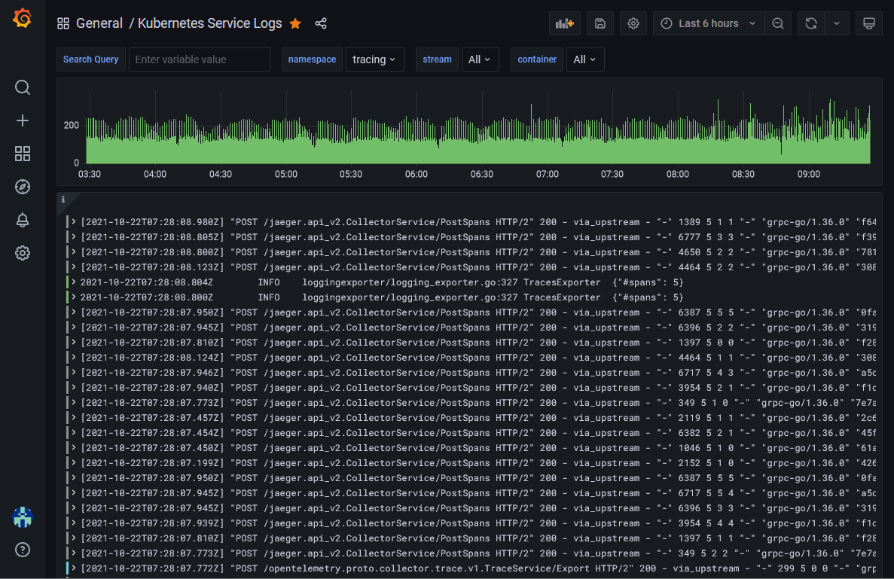
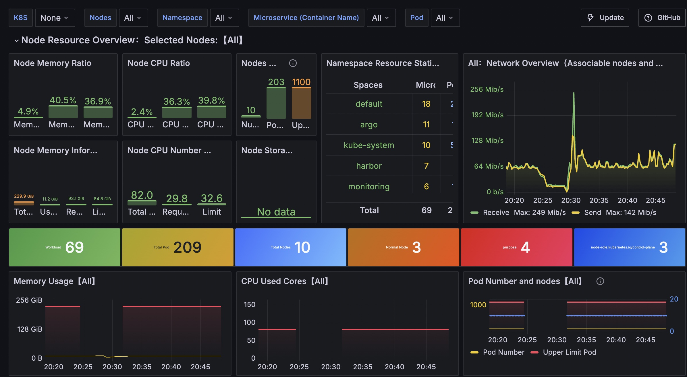

# Requirements

- Local Kubernetes cluster
- Helm 3+

# Setup

## 1. Create Namespace

```bash
kubectl create namespace obs
```

## 2. Deploy Loki Stack

Deploy a Loki monolithic stack with single binary deployment mode.

**Documentation:**
- [Loki Helm Chart](https://artifacthub.io/packages/helm/grafana/loki?modal=install)
- [Monolithic Installation Guide](https://grafana.com/docs/loki/latest/setup/install/helm/install-monolithic/#single-replica-or-multiple-replicas)

**Commands:**

```bash
helm repo add grafana https://grafana.github.io/helm-charts
helm install my-loki grafana/loki -n obs -f my-loki-values.yaml --version 6.53.0
```

**Loki Gateway URL:**
```
http://my-loki-gateway.obs.svc.cluster.local/
```


### ⚠️ Multi-Tenant Configuration

**Loki runs in multi-tenant mode by default** and requires the `X-Scope-OrgID` header for all requests.

#### Option 1: Disable Multi-Tenant Mode (Recommended for Lab/Dev)

Uncomment `auth_enabled: false` in [my-loki-values.yaml](my-loki-values.yaml):

```yaml
loki:
  auth_enabled: false
```

**Benefits:**
- ✅ No `X-Scope-OrgID` header required in Grafana datasource
- ✅ No `tenant_id` required in Promtail configuration
- ✅ Simpler setup for local development and labs

#### Option 2: Keep Multi-Tenant Mode (Current Configuration)

If you keep multi-tenant mode enabled, configure:

**Grafana Datasource:**
- Add HTTP header: `X-Scope-OrgID` with value `1` (or your chosen tenant ID)

**Promtail Configuration:**
```yaml
clients:
  - url: http://my-loki-gateway.obs.svc.cluster.local/loki/api/v1/push
    tenant_id: "1"
```


## 3. Deploy Grafana

**Documentation:**
- [Grafana Helm Chart](https://artifacthub.io/packages/helm/grafana-community/grafana)

**Commands:**

```bash
helm repo add grafana-community https://grafana-community.github.io/helm-charts/
helm install my-grafana grafana-community/grafana -n obs
```

**Post-installation:**
- Note the command to retrieve the default admin password (shown in deployment output)

### Configure Loki Datasource in Grafana

**Datasource URL:**
```
http://my-loki-gateway.obs.svc.cluster.local
```

**If using multi-tenant mode (Option 2):**
- Add HTTP Header: `X-Scope-OrgID` with value `1`

## 4. Deploy Promtail

Promtail runs as a DaemonSet to collect logs from all nodes and send them to Loki.

**Documentation:**
- [Promtail Installation Guide](https://grafana.com/docs/loki/latest/send-data/promtail/installation/#install-as-kubernetes-daemonset-recommended)

**Configuration:**

The [promtail.yaml](promtail.yaml) file is pre-configured for this setup.

If using multi-tenant mode (Option 2), ensure `tenant_id` is set:
```yaml
clients:
  - url: http://my-loki-gateway.obs.svc.cluster.local/loki/api/v1/push
    tenant_id: "1"
```

**Deploy:**

```bash
kubectl apply -f promtail.yaml
```

## 5. Deploy Prometheus

Prometheus collects metrics from Kubernetes nodes, pods, and services.

**Documentation:**
- [Prometheus Helm Chart](https://artifacthub.io/packages/helm/prometheus-community/prometheus)

**Commands:**

```bash
helm repo add prometheus-community https://prometheus-community.github.io/helm-charts
helm install my-prometheus prometheus-community/prometheus -n obs -f my-prometheus-values.yaml
```

**Prometheus Server URL:**
```
http://my-prometheus-server.obs.svc.cluster.local
```

### Configure Prometheus Datasource in Grafana

**Datasource URL:**
```
http://my-prometheus-server.obs.svc.cluster.local
```

## 6. Import Loki Dashboard in Grafana

To visualize Kubernetes logs from Loki, import this pre-built dashboard:

**Dashboard:**
- [Kubernetes Service Logs Dashboard](https://grafana.com/grafana/dashboards/15141-kubernetes-service-logs/)
- Dashboard ID: `15141`

**Import Steps:**
1. In Grafana, go to **Dashboards** → **New** → **Import**
2. Enter Dashboard ID: `15141`
3. Select your Loki datasource
4. Click **Import**



## 7. Import Prometheus Dashboard in Grafana

To visualize Kubernetes metrics from Prometheus, import this comprehensive dashboard:

**Dashboard:**
- [K8s Dashboard EN](https://grafana.com/grafana/dashboards/15661-k8s-dashboard-en-20250125/)
- Dashboard ID: `15661`

**Import Steps:**
1. In Grafana, go to **Dashboards** → **New** → **Import**
2. Enter Dashboard ID: `15661`
3. Select your Prometheus datasource
4. Click **Import**


